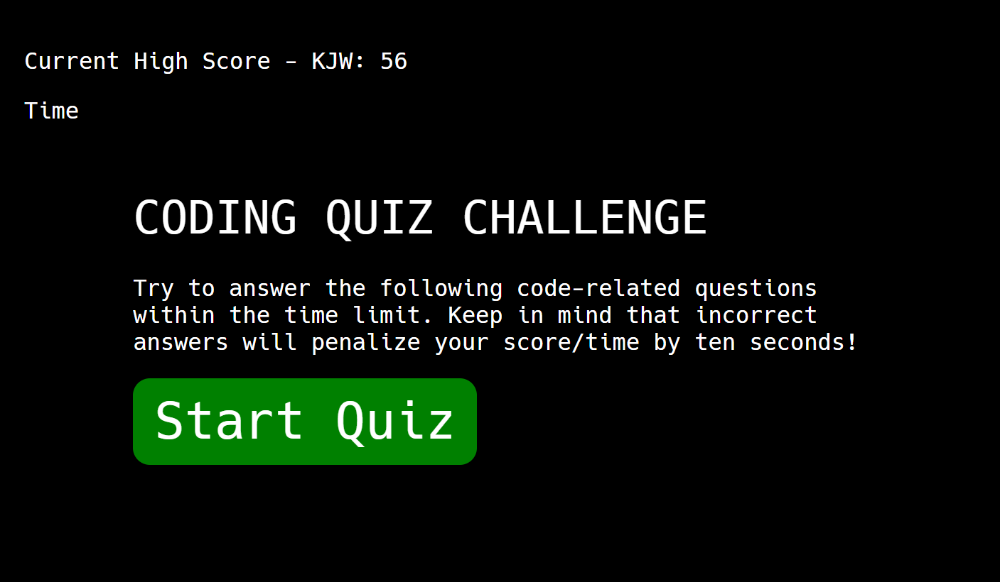

# Coding-Quiz-Challenge

For this project, we were tasked with building an interactive quiz that adhered to a specific set of criteria, namely:
- Upon clicking a start button, a timer starts and the first question is presented
- After answering a question, the next question is presented
- When a question is answered incorrectly, time is subtracted from the timer
- When all questions are answered or the timer reaches 0, the quiz ends
- When the quiz ends, a new high score can be saved

A custom font was also integrated to mimic the look of a code editor.

[Link to deployed application](https://kevinjwilkerson.github.io/Coding-Quiz-Challenge/)

# Screenshot
